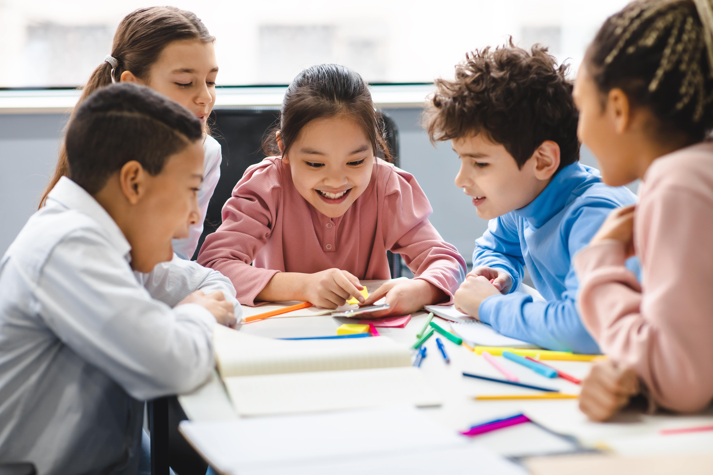
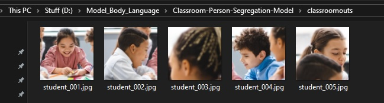
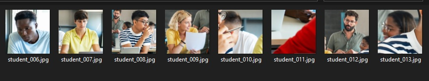
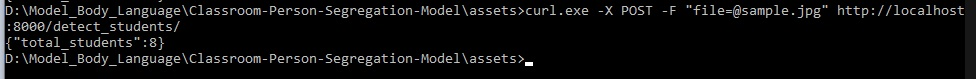

## 🎓 Classroom Person Segregation Models

This project detects and segments **students in classroom images** using **YOLOv8 segmentation**.  
It blurs the background ( or choose no blur model ) while keeping each person sharp and saves them as cropped images.  
Built with **FastAPI** for easy API integration.  

---

## 🚀 Features
- Detects all people in a classroom image using **YOLOv8x-seg**.
- Blurs the background while keeping students in focus.
- Crops and saves each student into a square image.
- Provides an easy-to-use **FastAPI endpoint** for uploading and processing images.

---

## 🛠️ Installation

1. Clone the repository:
   ```bash
   git clone https://github.com/your-username/Classroom-Person-Segregation-Model.git
   cd Classroom-Person-Segregation-Model
   ```

2. Create a virtual environment (optional but recommended):
   ```bash
   python -m venv venv
   source venv/bin/activate    # On Linux/Mac
   venv\Scripts\activate       # On Windows
   ```

3. Install dependencies:
   ```bash
   pip install -r requirements.txt
   ```

4. Download the YOLOv8 segmentation model if not already present:
   ```bash
   # This will be handled automatically by ultralytics
   # But you can also download manually if needed
   ```

---

## ▶️ Running the Application

Start the FastAPI server:

```bash
python body_lang_3.py
```

By default, it runs on `http://localhost:8000`.

---

## 📤 Usage

### Upload an Image

Using **PowerShell**:
```bash
curl.exe -X POST -F "file=@image_1.jpg" http://localhost:8000/detect_students/
```

Using **Linux / Mac terminal**:
```bash
curl -X POST -F "file=@image_1.jpg" http://localhost:8000/detect_students/
```

### Response
Blur Model Sample Image 1:
```json
{
  "total_students": 5
}
```
No Blur Model Sample Image 2:
```json
{
  "total_students": 8
}
```

### Output
* Cropped student images are saved in the `classroomouts/` directory.
* Each cropped image is **300x300** with the background blurred.

---

## 📂 Example

### For Blur Model 
Input Classroom Image ⬇️



Output (segregated students with blurred background) ⬇️


<br>
Command Prompt Output <br>


---

### For No Blur Model
Input Classroom Image ⬇️ <br>
<br>


Output (segregated students) ⬇️


<br>
Command Prompt Output <br>



## ⚡ Tech Stack

* [Python](https://www.python.org/)
* [OpenCV](https://opencv.org/)
* [Ultralytics YOLOv8](https://github.com/ultralytics/ultralytics)
* [FastAPI](https://fastapi.tiangolo.com/)
* [Uvicorn](https://www.uvicorn.org/)

---

## 📜 License

This project is licensed under the MIT License - see the [LICENSE](LICENSE) file for details.

---

## 🙌 Acknowledgements

* [Ultralytics YOLOv8](https://github.com/ultralytics/ultralytics) for object detection and segmentation.
* [FastAPI](https://fastapi.tiangolo.com/) for creating a lightweight and fast API.
